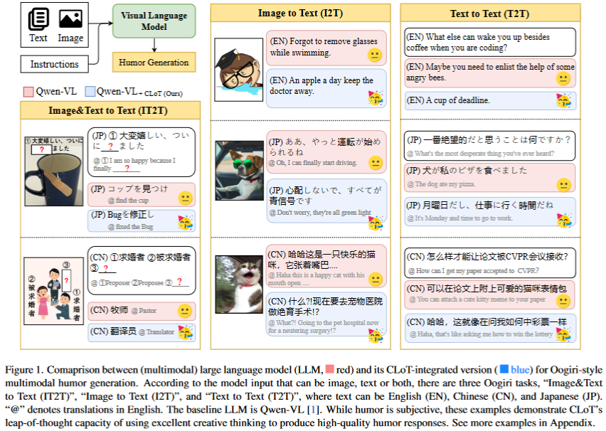

## Creative Leap-of-Thought (CLoT)
[](www.google.com)
[](https://zhongshsh.github.io/CLoT/)
</br>


<p align="center">
   
</p>

By [Shanshan Zhong](https://github.com/zhongshsh)<sup>* 1,2</sup> and [Zhongzhan Huang](https://dedekinds.github.io)<sup>* 1,2</sup> and [Shanghua Gao](https://shgao.site/)<sup>3</sup>  and [Wushao Wen](https://scholar.google.com/citations?user=FSnLWy4AAAAJ)<sup>2</sup> and [Liang Lin](http://www.linliang.net)<sup>2</sup>  </br> and [Marinka Zitnik](https://zitniklab.hms.harvard.edu/)<sup>3</sup> and [Pan Zhou](https://panzhous.github.io/)<sup>#1</sup>

<sup>1</sup> Sea AI Lab  <sup>2</sup> Sun Yat-sen University <sup>3</sup> Harvard University</br>
<sup>* </sup>Equal contribution <sup>#</sup>Corresponding author

This repository is the official codebase of "Let's Think Outside the Box: Exploring Leap-of-Thought in Large Language Models with Creative Humor Generation" [[paper]](www.google.com). 

🤣👉**Click [[project page]](https://zhongshsh.github.io/CLoT/) for more funny examples**👈.


## 🤣 Introduction

To the best of our knowledge, we are the first to profoundly explore the Leap-of-Thought (LoT) ability in multimodal large language models (LLMs). This involves challenging LLMs to **think outside the box**, a non-sequential thinking skill equally crucial alongside popular sequential thinking abilities, such as Chain-of-Thought based methods. In this study, we delve into the LLM's LoT ability through the lens of a humor generation game called Oogiri (大喜利). The Oogiri game serves as an ideal platform for exploring the LLM's LoT ability, as it compels participants to think outside the box and provide unexpected and humorous responses to multimodal information (including I2T, T2T, and IT2T). 

<p align="center">
  
</p>

## 😆 News

2023/12/6 - We released our project page [[project page]](https://zhongshsh.github.io/CLoT/). 👈😆Please check it out! 

2023/12/5 - We released our paper [[arxiv]](www.google.com). Please check it out! 


## 😂 TODO

- [x] project page
- [x] preprint paper
- [ ] online demo (HuggingFace etc.)
- [ ] code
- [ ] dataset


## 😄 Citation

```
@misc{zhong2023clot,
  title={Let's Think Outside the Box: Exploring Leap-of-Thought in Large Language Models with Creative Humor Generation},
  author={Zhong, Shanshan and Huang, Zhongzhan and Gao, Shanghua and Wen, Weushao and Lin, Liang and Zitnik, Marinka and Zhou, Pan},
  booktitle={arxiv},
  year={2023}
}
```
